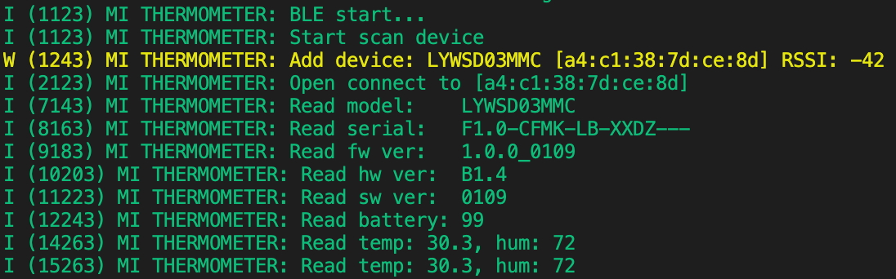

== ESP32 đọc cảm biến nhiệt độ Mijia Bluetooth Thermometer 2 (LYWSD03MMC)

=== Thiết bị cần thiết

- Kit ESP32
- Cảm biến nhiệt LYWSD03MMC

image::./images/device.jpg[]

- Điện thoại cài app BLE Scanner 

=== Tìm kiếm Characteristic đọc nhiệt độ và độ 

- Mở app BLE Scanner kết nối vào cảm biến LYWSD03MMC tìm kiếm Service có Characteristic mang tên (TEMPERATURE AND HUMIDITY)

image::./images/app.png[]

- Copy dòng mã hex của Characteristic

.Khai báo MI_DATA_CHAR_UUID
[source, c]
----
const uint8_t MI_DATA_CHAR_UUID[] = {0xa6, 0xa3, 0x7d, 0x99, 0xf2, 0x6f, 0x1a, 0x8a, 0x0c, 0x4b, 0x0a, 0x7a, 0xc1, 0xcc, 0xe0, 0xeb};
----

=== Khởi tạo ble 
[source, c]
----
esp_err_t mi_init(void) {
    esp_err_t ret = ESP_FAIL;
    mi_thermometer.state = MI_INIT;
    mi_thermometer.event = xEventGroupCreate();
    xEventGroupClearBits(mi_thermometer.event, EVT_READY);
    xEventGroupClearBits(mi_thermometer.event, EVT_SEARCH_DEVICE);
    xEventGroupClearBits(mi_thermometer.event, EVT_OPEN);
    xEventGroupClearBits(mi_thermometer.event, EVT_CLOSE);
    xEventGroupClearBits(mi_thermometer.event, EVT_SEARCH_SERVICE);
    xEventGroupClearBits(mi_thermometer.event, EVT_READ);
    xEventGroupClearBits(mi_thermometer.event, EVT_WRITE);
    xEventGroupClearBits(mi_thermometer.event, EVT_REGISTER);
    esp_bt_controller_config_t bt_cfg = BT_CONTROLLER_INIT_CONFIG_DEFAULT();
    ret = esp_bt_controller_init(&bt_cfg);
    ERROR_CHECKE( ret != ESP_OK, "initialize controller failed", return ret);
    ret = esp_bt_controller_enable(ESP_BT_MODE_BLE);
    ERROR_CHECKE( ret != ESP_OK, "enable controller failed", return ret);
    ret = esp_bluedroid_init();
    ERROR_CHECKE( ret != ESP_OK, "init bluedroid failed", return ret);
    ret = esp_bluedroid_enable();
    ERROR_CHECKE( ret != ESP_OK, "enable bluedroid failed", return ret);
    ret = esp_ble_gap_register_callback(esp_gap_cb);
    ERROR_CHECKE( ret != ESP_OK, "gap register failed", return ret);
    ret = esp_ble_gattc_register_callback(esp_gattc_cb);
    ERROR_CHECKE( ret != ESP_OK, "gattc register failed", return ret);
    ret = esp_ble_gattc_app_register(MI_APPID);
    ERROR_CHECKE( ret != ESP_OK, "gattc app register failed", return ret);
    ret = esp_ble_gatt_set_local_mtu(200);
    ERROR_CHECKE( ret != ESP_OK, "set local MTU failed", return ret);
    xTaskCreate(&mi_task, "ble_task", 4 * 1024, NULL, 5, NULL);
    return ESP_OK;
}
----

- Đoạn code khởi tạo các event cần thiết và khởi tạo module BLE

- `esp_ble_gap_register_callback(esp_gap_cb)` khởi tạo hàm trả về khi có sự kiện từ lớp GAP (Generic Access Profile)
- `esp_ble_gattc_register_callback(esp_gattc_cb)` khởi tạo hàm trả về khi có sự kiện từ lớp GATT (Generic Attribute Profile)

=== Task xử lý việc kết nối và đọc giá trị 
[source, c]
----
void mi_task(void *pvParameters) {
    ESP_LOGI(TAG, "BLE start...");
    while (1) {
        switch(mi_thermometer.state) {
            case MI_INIT:
                if ((xEventGroupWaitBits(mi_thermometer.event, EVT_READY, false, true, 1000/portTICK_RATE_MS) & EVT_READY) == 0) { 
                    goto _continue;
                }
                ESP_LOGI(TAG, "Start scan device");
                esp_ble_gap_start_scanning(10000);
                mi_thermometer.state = MI_SCAN;
                break;
            case MI_SCAN:
                if ((xEventGroupWaitBits(mi_thermometer.event, EVT_SEARCH_DEVICE, false, true, 1000/portTICK_RATE_MS) & EVT_SEARCH_DEVICE) == 0) { 
                    goto _continue;
                }
                ESP_LOGI(TAG, "Open connect to ["ESP_BD_ADDR_STR"]", ESP_BD_ADDR_HEX(mi_thermometer.bda));
                esp_err_t ret = esp_ble_gattc_open(mi_thermometer.gattcif, mi_thermometer.bda, BLE_ADDR_TYPE_PUBLIC, true);
                ERROR_CHECKE(ret != ESP_OK, "gattc open failed", continue);
                mi_thermometer.state = MI_CONNECT;
                break;
            case MI_CONNECT:
                if ((xEventGroupWaitBits(mi_thermometer.event, EVT_OPEN, false, true, 1000/portTICK_RATE_MS) & EVT_OPEN) == 0) { 
                    goto _continue;
                }
                mi_thermometer.state = MI_SEARCH_SERVICE;
                break;
            case MI_SEARCH_SERVICE:
                _mi_read_device_services();
                mi_thermometer.state = MI_READ_MODEL;
                break;
            case MI_READ_MODEL:
                if(_mi_read_handle(mi_thermometer.gattcif, mi_thermometer.conn_id, mi_thermometer.model_char.handle, 200/portTICK_RATE_MS) != ESP_OK)
                    goto _continue;
                ESP_LOGI(TAG, "Read model: \t%s", mi_thermometer.model_char.data);
                mi_thermometer.state = MI_READ_SERIAL;
                break;
            case MI_READ_SERIAL:
                if(_mi_read_handle(mi_thermometer.gattcif, mi_thermometer.conn_id, mi_thermometer.serial_char.handle, 200/portTICK_RATE_MS) != ESP_OK)
                    goto _continue;
                ESP_LOGI(TAG, "Read serial: \t%s", mi_thermometer.serial_char.data);
                mi_thermometer.state = MI_READ_FW_VER;
                break;
            case MI_READ_FW_VER:
                if(_mi_read_handle(mi_thermometer.gattcif, mi_thermometer.conn_id, mi_thermometer.fw_char.handle, 200/portTICK_RATE_MS) != ESP_OK)
                    goto _continue;
                ESP_LOGI(TAG, "Read fw ver: \t%s", mi_thermometer.fw_char.data);
                mi_thermometer.state = MI_READ_HW_VER;
                break;
            case MI_READ_HW_VER:
                if(_mi_read_handle(mi_thermometer.gattcif, mi_thermometer.conn_id, mi_thermometer.hw_char.handle, 200/portTICK_RATE_MS) != ESP_OK)
                    goto _continue;
                ESP_LOGI(TAG, "Read hw ver: \t%s", mi_thermometer.hw_char.data);
                mi_thermometer.state = MI_READ_SW_VER;
                break;
             case MI_READ_SW_VER:
                if(_mi_read_handle(mi_thermometer.gattcif, mi_thermometer.conn_id, mi_thermometer.sw_char.handle, 200/portTICK_RATE_MS) != ESP_OK)
                    goto _continue;
                ESP_LOGI(TAG, "Read sw ver: \t%s", mi_thermometer.sw_char.data);
                mi_thermometer.state = MI_READ_BATTERY;
                break;
            case MI_READ_BATTERY:
                if(_mi_read_handle(mi_thermometer.gattcif, mi_thermometer.conn_id, mi_thermometer.battery_char.handle, 200/portTICK_RATE_MS) != ESP_OK)
                    goto _continue;
                ESP_LOGI(TAG, "Read battery: %d", mi_thermometer.battery_char.data[0]);
                mi_thermometer.state = MI_READ_TEMP_HUM;
                break;
            case MI_READ_TEMP_HUM:
                if(_mi_register_for_notify(mi_thermometer.gattcif, mi_thermometer.bda, mi_thermometer.temp_hum_char.handle) != ESP_OK)
                    goto _continue;
                if(_mi_write_char_descr(mi_thermometer.gattcif, mi_thermometer.conn_id, mi_thermometer.handle_write) != ESP_OK)
                    goto _continue;
                mi_thermometer.state = MI_IDLE;
                break;
            case MI_IDLE:
                if((mi_thermometer.temp != 0) && (mi_thermometer.hum != 0))
                    ESP_LOGI(TAG, "Read temp: %2.1f, hum: %d", mi_thermometer.temp/100, mi_thermometer.hum);
                break;
            default:
                break;
        }
_continue:
        vTaskDelay(1000 / portTICK_RATE_MS);
    }
    vTaskDelete(NULL);
}
----

- `esp_ble_gap_start_scanning(10000)` khởi tạo GAP tìm kiếm thiết bị từ BLE, timeout sau 10s 

.Thông tin thiết bị trả về trong hàm `esp_gap_cb`
[source, c]
----
case ESP_GAP_SEARCH_INQ_RES_EVT:
    adv_name = esp_ble_resolve_adv_data(scan_result->scan_rst.ble_adv,
                                        ESP_BLE_AD_TYPE_NAME_CMPL, &adv_name_len);
    bool is_exist = false;
    if (adv_name_len > 0 && strcmp((char*)"LYWSD03MMC", (char*)adv_name) == 0) {
        is_exist = true;
    }
    if (is_exist) {
        ESP_LOGW(TAG, "Add device: %s ["MACSTR"] RSSI: %d", adv_name, MAC2STR(scan_result->scan_rst.bda), scan_result->scan_rst.rssi);
        memcpy(mi_thermometer.bda, scan_result->scan_rst.bda, sizeof(esp_bd_addr_t));
        esp_ble_gap_stop_scanning();
        xEventGroupSetBits(mi_thermometer.event, EVT_SEARCH_DEVICE);
    }
    break;
----

- Tìm cảm biến có tên là "LYWSD03MMC" và lưu lại bda (Bluetooth device address) và dừng GAP scan

- `esp_ble_gattc_open(mi_thermometer.gattcif, mi_thermometer.bda, BLE_ADDR_TYPE_PUBLIC, true)` mở kết nối tới cảm biến "LYWSD03MMC"

.Sau khi mở kết nối hoàn tất ta tìm kiếm dịch vụ và ứng dụng `_mi_read_device_services`
[source, c]
----
if (esp_ble_gattc_get_service(mi_thermometer.gattcif, mi_thermometer.conn_id, NULL, service_result, &scount, 0) == ESP_OK) {
        for (uint16_t s = 0; s < scount; s++) {
            esp_gattc_char_elem_t char_result[20];
            uint16_t ccount = 20;
            if (esp_ble_gattc_get_all_char(mi_thermometer.gattcif, mi_thermometer.conn_id, service_result[s].start_handle, service_result[s].end_handle, char_result, &ccount, 0) == ESP_OK) {
                for (uint16_t c = 0; c < ccount; c++) {
                    if(char_result[c].uuid.len == ESP_UUID_LEN_16) {
                        if(char_result[c].uuid.uuid.uuid16 == ESP_GATT_UUID_MODEL_NUMBER_STR) {
                            mi_thermometer.model_char.handle = char_result[c].char_handle;
                        }
                        else if(char_result[c].uuid.uuid.uuid16 == ESP_GATT_UUID_SERIAL_NUMBER_STR) {
                            mi_thermometer.serial_char.handle = char_result[c].char_handle;
                        }
                        else if(char_result[c].uuid.uuid.uuid16 == ESP_GATT_UUID_FW_VERSION_STR) {
                            mi_thermometer.fw_char.handle = char_result[c].char_handle;
                        }
                        else if(char_result[c].uuid.uuid.uuid16 == ESP_GATT_UUID_HW_VERSION_STR) {
                            mi_thermometer.hw_char.handle = char_result[c].char_handle;
                        }
                        else if(char_result[c].uuid.uuid.uuid16 == ESP_GATT_UUID_SW_VERSION_STR) {
                            mi_thermometer.sw_char.handle = char_result[c].char_handle;
                        }
                        else if(char_result[c].uuid.uuid.uuid16 == ESP_GATT_UUID_BATTERY_LEVEL) {
                            mi_thermometer.battery_char.handle = char_result[c].char_handle;
                        }
                    }
                    else {
                        if(memcmp(char_result[c].uuid.uuid.uuid128, MI_DATA_CHAR_UUID, char_result[c].uuid.len) == 0) {
                            mi_thermometer.temp_hum_char.handle = char_result[c].char_handle;
                            esp_gattc_descr_elem_t descr_result[20];
                            uint16_t dcount = 20;
                            if (esp_ble_gattc_get_all_descr(mi_thermometer.gattcif, mi_thermometer.conn_id, char_result[c].char_handle, descr_result, &dcount, 0) == ESP_OK) {
                                for (uint16_t d = 0; d < dcount; d++) {
                                    if (descr_result[d].uuid.uuid.uuid16 == ESP_GATT_UUID_CHAR_CLIENT_CONFIG) {
                                        mi_thermometer.handle_write = descr_result[d].handle;
                                    }
                                }
                            } 
                        }
                    }
                }
            }
        }
    }
----
- Tìm kiếm tất cả dịch vụ có UUID trùng với UUID đã khai báo ở trên và lưu lại handle 
- Sau khi tìm kiếm được ứng dụng ta có thể đọc (Model, Serial, Firmware version, Hardware version, Software version, Battery level) qua hàm `_mi_read_handle`

==== Đối với đọc nhiệt độ và độ ẩm:

- `_mi_register_for_notify(mi_thermometer.gattcif, mi_thermometer.bda, mi_thermometer.temp_hum_char.handle)` đăng ký giá trị trả về qua notify 
- `_mi_write_char_descr(mi_thermometer.gattcif, mi_thermometer.conn_id, mi_thermometer.handle_write)` ghi vào characteristic để active notify
 
.Giá trị sẽ trả về qua `esp_gattc_cb`
[source, c]
----
case ESP_GATTC_READ_CHAR_EVT:
case ESP_GATTC_READ_DESCR_EVT: {
    if(p_data->read.conn_id == mi_thermometer.conn_id) {
        _mi_char_data(p_data->read.value, p_data->read.value_len);
        xEventGroupSetBits(mi_thermometer.event, EVT_READ);
    }
    break;
}
case ESP_GATTC_NOTIFY_EVT: {
    if(p_data->notify.conn_id == mi_thermometer.conn_id) {
        _mi_char_data(p_data->notify.value, p_data->notify.value_len);
    }
    break;
}
----
 
- `_mi_char_data(p_data->read.value, p_data->read.value_len)` lưu lại giá trị của cảm biến "LYWSD03MMC"

Source code https://github.com/phult-ad/esp32_xiaomi_thermometer[Link]

=== Kết quả 

=== Tham khảo

* Giao thức BLE https://htelectronics.vn/huong-dan-giao-tiep-voi-smartphone-may-tinh-bang-qua-bluetooth-low-energy-ble-phan-6/[Link]
* Ví dụ BLE https://github.com/espressif/esp-idf/tree/master/examples/bluetooth/bluedroid/ble[Link]
 
 
 
 
 
 
 
 
 
 
 
 
 
 
 
 
 
 
 
 

